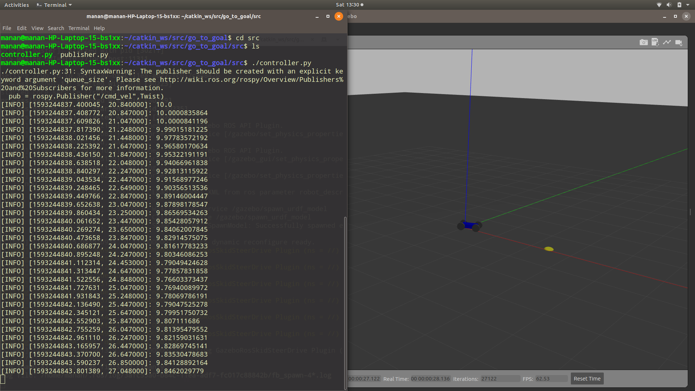

## How to run ?

1. To run , clone this repo into your catkin_ws

2. run catkin_make , to compile the package

3. Then first the simulation of the robot made by us(remember to checkout sensor branch!)

4. Run the code

```
 rosrun go_to_goal controller.py

```

5. Output:

